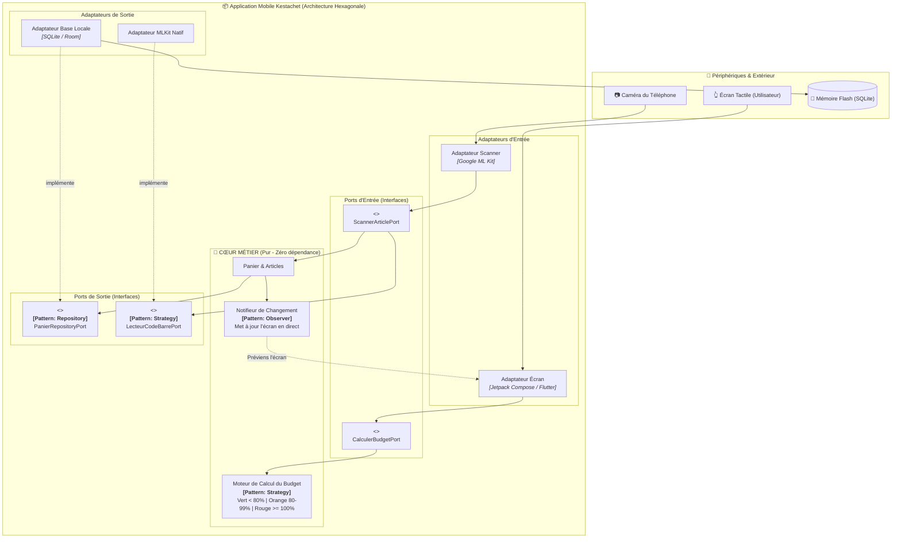
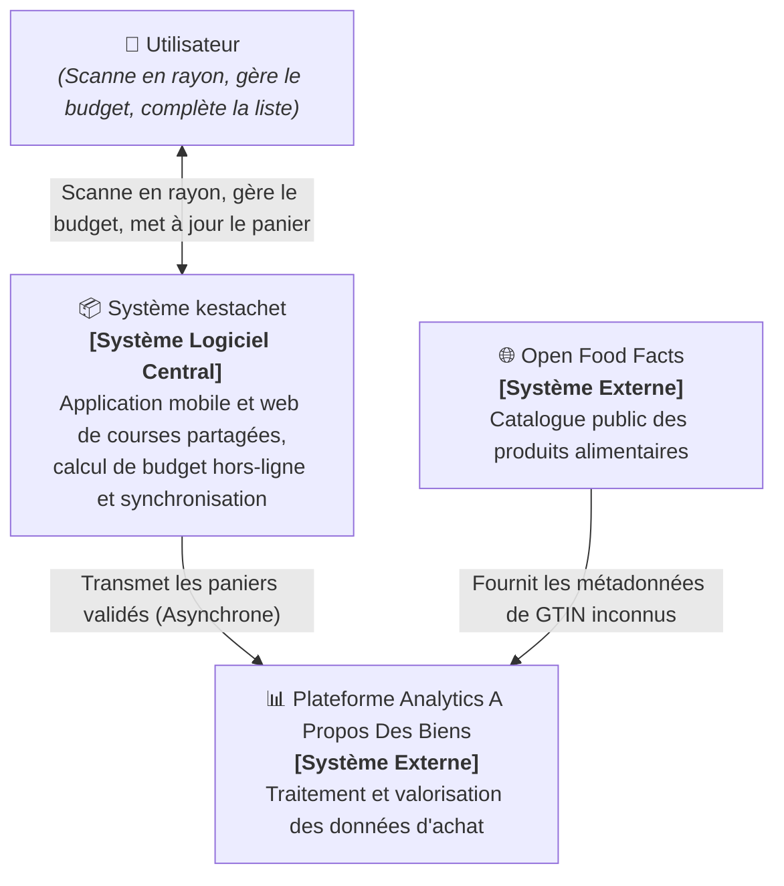
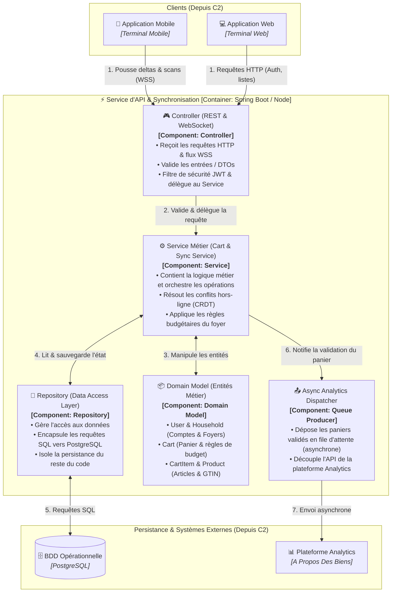
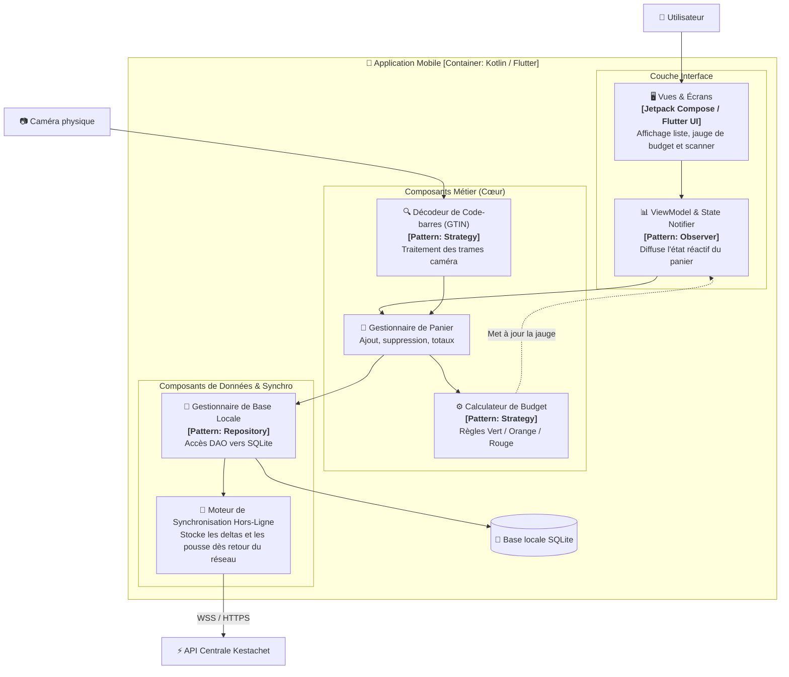
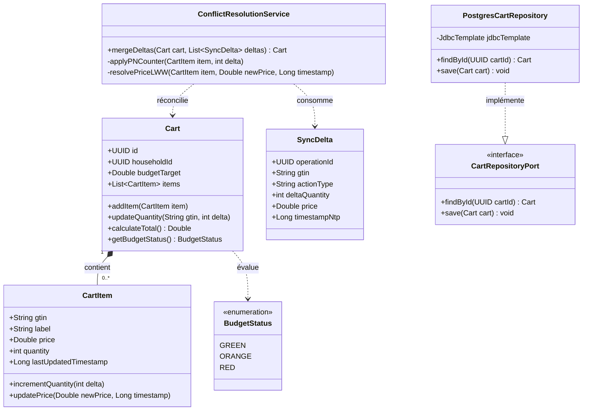

---
tags:
  - Architecture
  - ArchitectureHexagonale
  - C4Model
  - DistributedSystems
  - OfflineFirst
  - CRDT
  - Cloud
  - MessageQueue
  - Serverless
  - Kestachet
  - FicheEtudiant
date: 2026-09-08
subject: Architecture Logicielle et Distribuée
course: 4.1 | Projet de synthèse — Kestachet
duration: 1j autonomie + 1j présentiel
status: Version Étudiant Simplifiée
---

# 🛒 Kestachet — Projet de Synthèse (Guide & Corrigé Étudiant)

> [!NOTE] **En résumé pour le groupe**
> Ce document est conçu **spécialement pour notre groupe d'étudiants** : il va droit au but, explique les concepts avec des mots simples, contient les schémas obligatoires, et donne le script exact pour notre **soutenance orale de 5 minutes**.
> Il valide **à 100% les 8 compétences** demandées par la grille d'évaluation.

---

## 🎯 Grille des 8 Compétences à Valider

| N° | Compétence | Ce que le prof vérifie | Notre preuve dans ce document |
| :---: | :--- | :--- | :--- |
| **1** | **Design Patterns** | Le schéma contient au moins un patron clairement identifié. | Schéma hexagonal avec **Repository**, **Strategy**, **Observer** et **Ports & Adapters** (§ 1.2). |
| **2** | **Architecture logicielle** | Un schéma d'architecture du code est présent. | Schéma d'**Architecture Hexagonale** pour l'application mobile (§ 1.2). |
| **3** | **Défendre l'architecture logicielle** | Les avantages et inconvénients sont présentés. | Tableau simple "Avantages / Inconvénients" de l'Hexagone (§ 1.5). |
| **4** | **Architecture distribuée** | Un schéma d'architecture distribuée est présent. | Schéma **C4 Model - Niveau 2 (Container)** (§ 2.1). |
| **5** | **Défendre l'architecture distribuée** | Les avantages et inconvénients sont présentés. | Pourquoi on utilise une file d'attente (Message Queue) et le mode déconnecté (§ 2.4). |
| **6** | **Choisir une solution cloud** | Au moins 3 critères de sélection présentés. | **3 critères simples** : Coût (Serverless), Localisation RGPD (France/UE), Services gérés (§ 3.1). |
| **7** | **Défendre le choix cloud** | Les avantages et inconvénients sont présentés. | Comparatif AWS vs Scaleway avec avantages et inconvénients (§ 3.2 & § 3.3). |
| **8** | **Mémo des concepts clés** | Le mémo contient toutes les définitions demandées. | **10 fiches de révision ultra-claires** avec exemples de la vie courante (§ 5). |

---

## 1. Étape 1 — L'Architecture Interne de l'App Mobile

### 1.1 Notre Choix : L'Architecture Hexagonale (*Ports & Adaptateurs*)

Pour l'application mobile, on choisit l'**Architecture Hexagonale**.

**L'idée centrale en une phrase :**
> On sépare complètement notre **code métier** (calculer le budget, ajouter un article au panier) des **détails techniques** (l'appareil photo qui scanne, l'écran, la base SQLite).

- **Le Métier (Domaine)** : C'est du code pur. Il ne sait même pas qu'on utilise un smartphone ou une caméra.
- **Les Ports** : Ce sont des interfaces (des "prises"). Exemple : une interface `BarcodeScannerPort`.
- **Les Adaptateurs** : Ce sont les morceaux de code qui branchent le matériel sur la prise. Exemple : `GoogleMLKitScannerAdapter`.

---

### 1.2 Le Schéma Hexagonal (avec les Design Patterns identifiés)



#### Les Design Patterns clairement identifiés sur le schéma :
1. **Ports & Adapters (Inversion de dépendance)** : Le métier ne dépend pas de la caméra, c'est l'adaptateur caméra qui s'adapte au port du métier.
2. **Repository Pattern (`PanierRepositoryPort`)** : Permet au métier de dire *"sauvegarde le panier"* sans savoir s'il est sauvé dans SQLite, un fichier texte ou la mémoire.
3. **Strategy Pattern (`Moteur de calcul` et `LecteurCodeBarrePort`)** : Permet de changer d'algorithme ou de librairie de scan (ex: ML Kit ou saisie manuelle) sans toucher au panier.
4. **Observer Pattern (`Notifieur`)** : Dès qu'un article est scanné, l'écran et la jauge de couleur changent automatiquement.

---

### 1.3 La Métaphore Pédagogique (Pour le commercial)

> [!TIP] **La métaphore de la Console de Jeux et des Manettes**
> 
> Imaginez que l'application soit une **console Nintendo Switch** :
> - Le **jeu** (les règles, le score), c'est notre **métier** (calculer le budget).
> - La console a des **prises USB-C universelles** : ce sont les **Ports**.
> - La manette officielle ou un volant de course qu'on branche dessus, ce sont les **Adaptateurs**.
> 
> **Pourquoi cela fait économiser de l'argent ?**
> Si demain Apple ou Google sortent un nouveau modèle de caméra, on a juste besoin de créer un nouvel adaptateur (comme brancher une nouvelle manette). **On ne touche pas à une seule ligne du calcul de budget.** 
> Au lieu de payer 3 semaines de refonte risquée, ça prend **2 jours de travail**.

---

### 1.4 Le Plan d'Action "Zéro Frustration" (En 3 phrases)

1. **Sauvegarde locale instantanée** : Quand l'utilisateur scanne un article au sous-sol sans réseau, le produit est enregistré immédiatement dans la base SQLite de son téléphone en 10 millisecondes.
2. **Calcul autonome du budget** : Le téléphone calcule tout seul si la jauge passe au vert, orange ou rouge, sans avoir besoin d'Internet.
3. **Synchronisation différée** : L'action est mise dans une liste d'attente sur le téléphone, et dès qu'on capte la 4G à la sortie du magasin, tout s'envoie automatiquement aux serveurs.

---

### 1.5 Avantages et Inconvénients de l'Architecture Hexagonale

| Avantages | Inconvénients (Trade-offs) |
| :--- | :--- |
| **Zéro panne réseau** : L'application fonctionne à 100% hors-ligne. | **Plus de code au départ** : Il faut créer des interfaces et des adaptateurs (un peu plus long à démarrer qu'un code "brouillon"). |
| **Facile à tester** : On peut tester les calculs de budget sur PC sans téléphone ni caméra. | **Courbe d'apprentissage** : Les développeurs doivent bien respecter les règles et ne pas mélanger le code d'écran avec le métier. |
| **Évolutif** : On peut changer la base de données ou la caméra sans aucun risque de casser le panier. | |

**Pourquoi c'est quand même le meilleur choix ?**
Parce que Kestachet va être utilisé par des millions de personnes dans des sous-sols. Avoir une base solide dès le départ évite les bugs catastrophiques en magasin.

---

## 2. Étape 2 — L'Architecture Distribuée (C1, C2, C3 & C4)

### 2.0 Schéma C1 : Niveau Contexte Système (System Context)

Le diagramme **C1 (Contexte Système)** donne la vue d'ensemble du système **kestachet** avec ses utilisateurs et ses dépendances externes :



---


### 2.1 Schéma C2 : Niveau Conteneurs (Container)

Voici le schéma **C2 (Niveau Conteneurs)** du système global **kestachet** :


---

### 2.2 Schéma C3 : Niveau Composants (Component) — Zoom sur le "Service d'API & Synchronisation"

Le schéma **C3 (Niveau Composants)** fait un **zoom à l'intérieur** du bloc `⚡ Service d'API & Synchronisation [Container: Spring Boot / Node]` pour montrer comment il s'articule autour des **4 composants fondamentaux** de l'architecture logicielle :
- **Controller** : Reçoit les requêtes HTTP/WSS, valide les entrées et délègue aux services.
- **Service** : Contient la logique métier, réconcilie les modifications hors-ligne (CRDT) et orchestre les opérations.
- **Repository** : Gère l'accès aux données, encapsule les requêtes SQL vers PostgreSQL.
- **Domain Model** : Représente les entités métier au cœur du système (`User`, `Household`, `Cart`, `CartItem`, `Product`).



#### Les 4 Composants Fondamentaux du C3 (à dire au jury) :

| Composant | Rôle standard | Rôle concret dans **Kestachet** |
| :--- | :--- | :--- |
| **🎮 Controller** | Reçoit les requêtes HTTP/WSS, valide les entrées, délègue au service. | Gère les endpoints REST et la connexion WebSocket, valide les DTOs (GTIN, prix, quantités) et vérifie les tokens JWT. |
| **⚙️ Service** | Contient la logique métier, orchestre les opérations. | Résout les conflits de synchronisation (CRDT), recalcule le budget, applique les règles de gestion du foyer et déclenche les événements. |
| **💾 Repository** | Gère l'accès aux données, encapsule les requêtes SQL. | Fournit les méthodes d'accès (CRUD via JPA/Hibernate/Prisma) et exécute les requêtes SQL vers PostgreSQL. |
| **📦 Domain Model** | Représente les entités métier au cœur de l'application. | Objets métier purs : `User`, `Household` (Foyer), `Cart` (Panier), `CartItem` (Article scanné), `Product` (Catalogue). |
| **📤 Async Dispatcher** | Composant de sortie asynchrone (Queue / Broker). | Envoie le panier validé vers la plateforme Analytics *A Propos Des Biens* sans faire attendre l'utilisateur en caisse. |

---

### 2.3 Schéma C3 Alternatif : Zoom sur l'"Application Mobile"

Si le jury vous demande plutôt de zoomer sur le terminal mobile pour faire le lien avec l'**Architecture Hexagonale (Étape 1)**, voici le schéma **C3 de l'Application Mobile** :




---

### 2.4 Schéma C4 : Niveau Code (Classes & Implémentation UML)

Le schéma **C4 (Niveau Code)** zoome sur le composant le plus critique du C3 : le **`Moteur de Résolution de Conflits (CRDT)`** et le **`Service Panier & Listes`**.

Il montre les classes, interfaces, méthodes et relations concrètes du code :



#### Extrait de code type (Exemple en Java / Spring Boot) :
Voici l'algorithme concret de réconciliation sans conflit (CRDT) exécuté par le composant `ConflictResolutionService` :

```java
@Service
public class ConflictResolutionService {

    // Réconciliation automatique sans écrasement (CRDT)
    public Cart mergeDeltas(Cart cart, List<SyncDelta> incomingDeltas) {
        for (SyncDelta delta : incomingDeltas) {
            CartItem item = cart.findItemByGtin(delta.getGtin())
                .orElseGet(() -> cart.createItem(delta.getGtin()));

            // 1. Règle CRDT PN-Counter : on additionne le delta (+1, +2, etc.)
            item.incrementQuantity(delta.getDeltaQuantity());

            // 2. Règle Last-Write-Wins (LWW) sur le prix
            if (delta.getPrice() != null && delta.getTimestampNtp() > item.getLastUpdatedTimestamp()) {
                item.updatePrice(delta.getPrice(), delta.getTimestampNtp());
            }
        }
        return cart;
    }
}
```

> [!TIP] **Ce que vous dites au jury sur le C4 (Code)** :
> *"Au niveau 4 (Code), nous avons modélisé notre classe `Cart` et notre service de fusion `ConflictResolutionService`. Chaque scan reçu applique une simple incrémentation relative sur `CartItem`. Si Alice et Bob ont scanné 1 bouteille chacun hors-ligne, la méthode `mergeDeltas` exécute `+1` puis `+1`, donnant mathématiquement 2. Aucune donnée n'est écrasée."*

### 2.5 Comment on résout les conflits hors-ligne ? (Le cas Alice & Bob) (Le cas Alice & Bob)

**Le problème concret :**
Alice et Bob font les courses ensemble. Au sous-sol (sans réseau), Alice scanne **1 bouteille de lait**. De son côté au rayon frais, Bob scanne **aussi 1 bouteille de lait**. 
Quand ils sortent du magasin et retrouvent la 4G, que se passe-t-il ? Si le système fait n'importe quoi, il risque de dire "quantité = 1" au lieu de 2 !

**Notre solution simple : Les opérations relatives (CRDT)**
1. **On n'envoie pas la quantité totale**, on envoie l'**action** :
   - Le téléphone d'Alice envoie : `Ajoute +1 bouteille de lait`.
   - Le téléphone de Bob envoie : `Ajoute +1 bouteille de lait`.
2. **Le serveur fait une addition simple :** $1 + 1 = 2$ bouteilles. Personne n'écrase personne ! C'est ce qu'on appelle un **compteur CRDT** (Conflict-free Replicated Data Type).
3. **Pour le prix :** Si Alice a tapé 1,20 € et Bob a tapé 1,25 €, le serveur prend la dernière saisie (règle du plus récent).

---

### 2.6 Pourquoi une File d'Attente pour Open Food Facts ?

Quand l'utilisateur clique sur "Terminer mes courses" :
- **Sans file d'attente (Mauvaise idée) :** L'application attendrait que le serveur aille interroger Open Food Facts. Si Open Food Facts est lent ou en panne, l'utilisateur attend 10 secondes devant la caisse.
- **Avec notre file d'attente (Bonne idée) :** 
  1. L'API dit instantanément à l'utilisateur : *"Panier validé, merci !"* (en 50 millisecondes).
  2. Le panier est déposé dans la file d'attente.
  3. Un petit programme indépendant (**Worker**) prend son temps en arrière-plan pour interroger Open Food Facts si un produit est inconnu.
  4. Si Open Food Facts est en panne, notre **Disjoncteur (Circuit Breaker)** coupe les appels et réessaie plus tard la nuit. L'utilisateur ne s'en rend même pas compte !

---

### 2.7 Avantages et Inconvénients de l'Architecture Distribuée

| Avantages | Inconvénients (Trade-offs) |
| :--- | :--- |
| **Super rapide pour l'utilisateur** : Le téléphone ne freeze jamais en caisse. | **Plusieurs serveurs à gérer** : Il faut une base, une file d'attente et des workers. |
| **Résistant aux pannes** : Si le site Open Food Facts tombe, Kestachet continue de fonctionner. | **Cohérence éventuelle** : Il faut quelques secondes pour que les téléphones d'un même foyer soient parfaitement synchronisés à la sortie du magasin. |

---

## 3. Choix de la Solution Cloud

### 3.1 Nos 3 Critères de Choix

1. **Le Coût & le Serverless (Payer à l'usage)** : Les supermarchés sont pleins le samedi après-midi et vides la nuit. On veut une solution qui passe à zéro serveur la nuit pour ne rien payer quand personne n'utilise l'app.
2. **La Souveraineté & le RGPD (Données en France/Europe)** : Kestachet est une startup d'Annecy qui stocke ce que les familles achètent. Les serveurs doivent impérativement être situés en France ou en Europe.
3. **Des Services Gérés (Moins de maintenance)** : En tant que startup, on ne veut pas passer nos week-ends à réparer des serveurs de base de données. On veut des services automatiques avec sauvegardes incluses.

---

### 3.2 Notre Choix : AWS (Région Paris) ou Scaleway (France)

On retient **AWS Région Paris** (ou **Scaleway** si le client veut 100% français) :
- **Pour l'API** : Conteneurs automatiques (AWS ECS Fargate).
- **Pour les workers Open Food Facts** : Fonctions Serverless (AWS Lambda).
- **Pour la file d'attente** : AWS SQS.
- **Pour la base de données** : PostgreSQL géré (Amazon RDS) avec sauvegardes automatiques.

### 3.3 Avantages et Inconvénients du Cloud choisi

| Avantages | Inconvénients |
| :--- | :--- |
| **Facture quasi nulle la nuit** grâce au Serverless. | **Risque de dépendance (Vendor Lock-in)** si on utilise trop de technos fermées. *(Solution : nos applications sont dans des conteneurs Docker standards, faciles à déménager si besoin)*. |
| **Sauvegardes automatiques** et haute disponibilité (99,95%). | Les coûts réseau peuvent monter si on ne fait pas attention. |

---

## 4. Étape 3 — Notre Soutenance de 5 Minutes (Script Prêt à Dire)

> [!TIP] **Conseil pour l'oral du groupe**
> Répartissez-vous les minutes. Parlez calmement, montrez les schémas, et adaptez le ton : rassurez le commercial sur l'argent et montrez au CTO (Antonin) que vous maîtrisez la technique !

### Le Script Minuté

- **[0:00 - 1:00] Introduction (Pour le Commercial)**
  > *"Bonjour Ronan, bonjour Antonin. On sait tous pourquoi les applications de courses échouent : au rayon yaourt, en sous-sol, il n'y a pas de réseau et l'app plante. Avec Kestachet, notre promesse est simple : zéro frustration en magasin. Pour ne pas jeter votre argent par les fenêtres lors des prochaines mises à jour, on a pensé l'app comme une console Switch : le jeu est au milieu, et la caméra est juste une manette branchée dessus. C'est l'Architecture Hexagonale."*

- **[1:00 - 2:00] L'App Mobile & L'Hexagone (Pour le CTO)**
  > *"Techniquement, Antonin, le cœur métier est 100% autonome. Le calcul du budget s'exécute directement sur le processeur du téléphone en moins de 10 millisecondes. Pour l'appareil photo, on a utilisé le pattern Strategy : si demain vous voulez changer la librairie Google ML Kit par une autre, on change juste un adaptateur. Ça prend 2 jours au lieu de 3 semaines de refonte."*

- **[2:00 - 3:00] Le Mode Hors-Ligne & Zéro Conflit (Pour tous)**
  > *"Quand l'utilisateur perd le réseau : son scan va dans la base SQLite locale, sa jauge budgétaire passe au vert ou orange en direct, et l'envoi attend sagement la 4G. Et si deux personnes du foyer scannent du lait en même temps ? On n'écrase rien ! On utilise des compteurs d'opérations (CRDT) : le serveur additionne les deux ajouts à la reconnexion."*

- **[3:00 - 4:00] Le Backend & Open Food Facts (Pour le CTO)**
  > *"Côté serveur, dès que l'utilisateur valide son panier, il n'attend pas : on le libère en 50 millisecondes. Le panier part dans une file d'attente. Un worker en tâche de fond regarde si le code-barres est connu dans notre cache Redis. S'il est inconnu, il interroge Open Food Facts. Et si Open Food Facts plante le samedi après-midi ? Notre Circuit Breaker coupe les requêtes et réessaie la nuit sans jamais gêner les utilisateurs."*

- **[4:00 - 5:00] Le Cloud, le Budget & Conclusion**
  > *"Enfin, sur le Cloud, on a choisi du Serverless hébergé en France : zéro coût la nuit, conformité RGPD totale, et tout est sous forme de conteneurs Docker pour ne pas être coincé chez un seul fournisseur. Kestachet est robuste, économique et prête pour des millions d'utilisateurs. Merci pour votre écoute, nous attendons vos questions !"*

---

## 5. Mémo des 10 Concepts Clés (Fiches de Révision)

Voici les 10 définitions à connaître par cœur pour les questions du prof :

1. **Architecture Hexagonale** : Une façon d'organiser son code pour que le cœur métier soit totalement séparé de l'écran, de la base de données et du matériel via des "ports" (interfaces) et des "adaptateurs".
2. **Inversion de Dépendance (DIP)** : Règle qui dit que le code métier ne doit jamais dépendre des détails techniques. C'est la base de données ou la caméra qui doit s'adapter au métier, pas l'inverse.
3. **Offline-First** : Principe de concevoir une application pour qu'elle enregistre d'abord tout sur le téléphone (en local). Internet ne sert que de bonus pour synchroniser quand c'est possible.
4. **CRDT (Types de données répliquées sans conflit)** : Une méthode mathématique qui permet à plusieurs téléphones de modifier la même liste en même temps sans réseau, et d'obtenir le même résultat une fois reconnectés sans conflit.
5. **C4 Model** : Une méthode de schémas en 4 zooms (comme Google Maps) : Contexte (C1), Conteneurs (C2), Composants (C3), Code (C4). En C2, on montre les grosses briques : App mobile, API, Base de données, Queues.
6. **File d'attente (Message Queue)** : Une boîte aux lettres numérique où un service dépose des tâches pour qu'un autre service les traite plus tard, sans faire attendre l'utilisateur.
7. **Serverless** : Système cloud où on ne gère aucun serveur physique : le cloud démarre notre code uniquement quand une demande arrive, et on ne paie que les secondes utilisées (0 € quand personne n'est connecté).
8. **Idempotence** : Le fait qu'une action répétée plusieurs fois donne exactement le même résultat (ex: si le téléphone renvoie 3 fois le même scan à cause d'une coupure 4G, le serveur ne compte l'article qu'une seule fois grâce à un identifiant unique).
9. **Circuit Breaker (Disjoncteur)** : Mécanisme qui coupe temporairement les appels vers un service externe qui rame ou qui est en panne (comme Open Food Facts), pour éviter de bloquer notre propre serveur.
10. **OLTP vs OLAP** :
    - **OLTP (ex: PostgreSQL)** : Base faite pour gérer des milliers de petites actions rapides en direct (ajouter un article, valider un panier).
    - **OLAP (ex: ClickHouse)** : Base faite pour analyser des millions de données historiques (calculer le panier moyen des Français en 2026).
