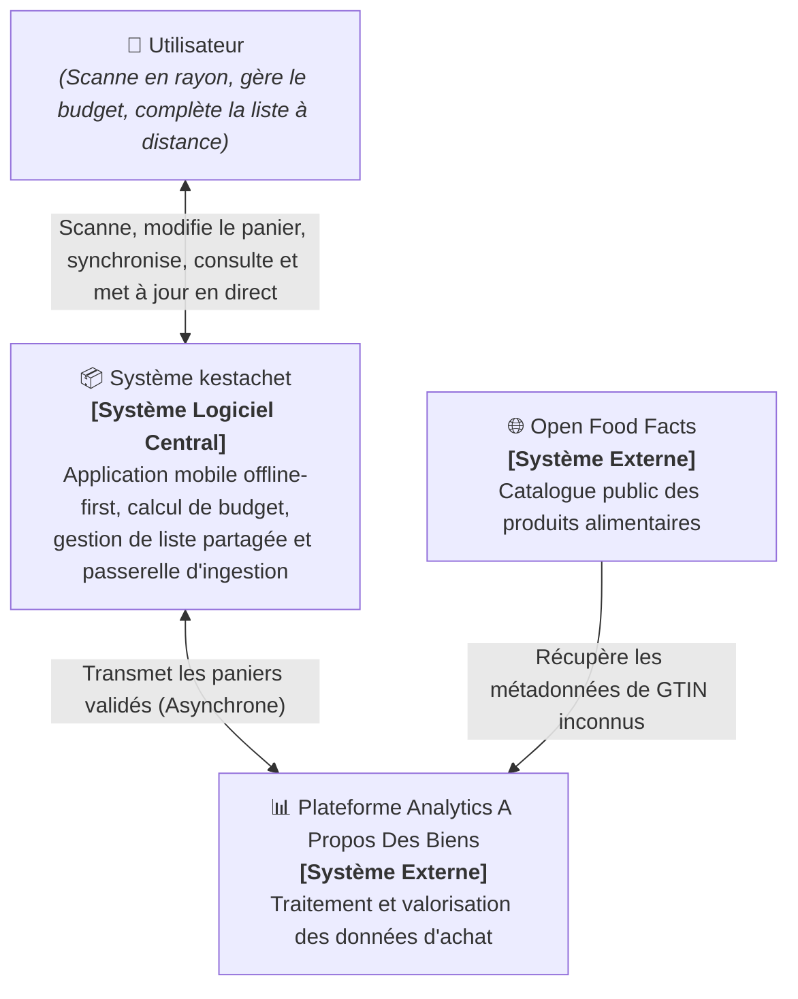
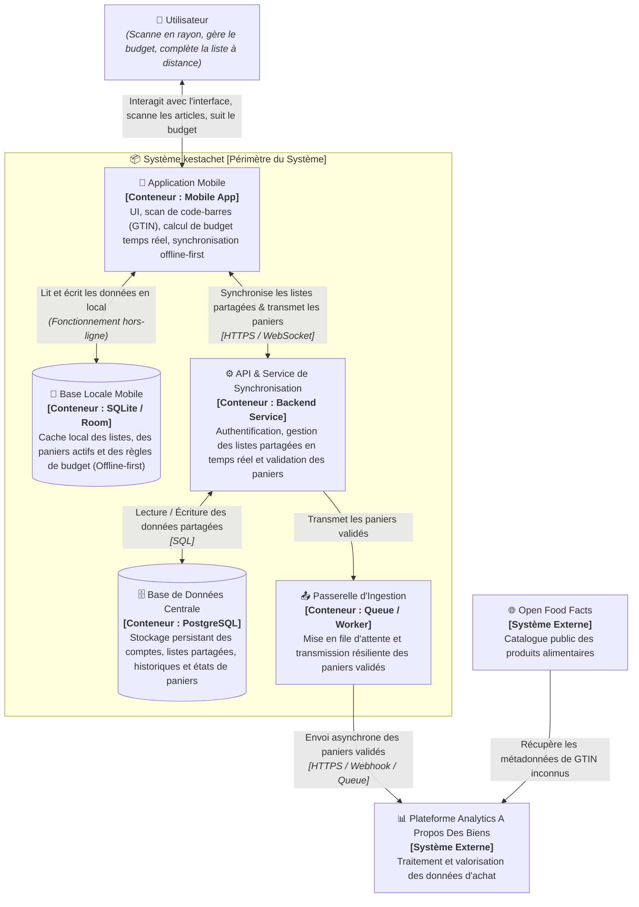

# Architecture C4 - kestachet

Ce document décrit l'architecture du système **kestachet** selon le modèle C4.

---

## 1. Niveau 1 : Contexte Système (C1)

Le diagramme de contexte présente les acteurs et les systèmes externes qui interagissent avec le système central **kestachet**.

---

## 2. Niveau 2 : Conteneurs (C2)

Le diagramme de conteneurs zoome à l'intérieur du système **kestachet** pour détailler les applications exécutables, les API, les bases de données et les services d'ingestion qui le composent.

### Description des Conteneurs

| Conteneur | Rôle & Responsabilités | Technologie indicative |
| :--- | :--- | :--- |
| **Application Mobile** | Interface principale de l'utilisateur. Embarque la logique de scan caméra, de calcul de budget en temps réel et de gestion de panier, utilisable sans connexion internet. | Flutter, React Native, Kotlin ou Swift |
| **Base Locale Mobile** | Assure la capacité **Offline-first**. Toutes les actions en magasin sont enregistrées immédiatement en local avant synchronisation. | SQLite / Room / WatermelonDB |
| **API Backend & Sync** | Reçoit les modifications de listes partagées, réconcilie les écritures concurrentes et enregistre les paniers validés. | Java (Spring Boot), Node.js, Go, etc. |
| **Base Centrale** | Stocke les profils, les listes de courses partagées entre membres, et l'historique complet des données du service. | PostgreSQL |
| **Passerelle d'Ingestion** | Découple kestachet de la plateforme Analytics externe via une file d'attente pour garantir qu'aucune donnée d'achat validée n'est perdue en cas d'indisponibilité du tiers. | RabbitMQ / Redis Queue / Worker Service |
