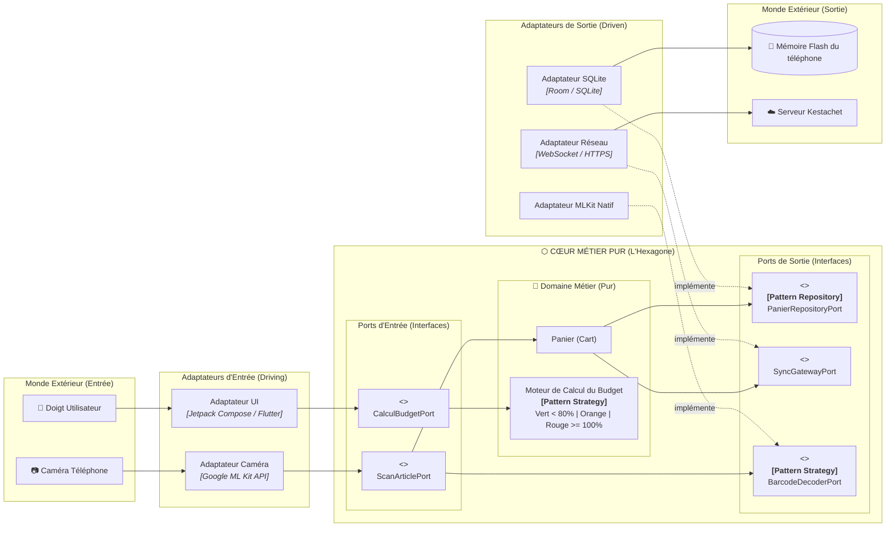
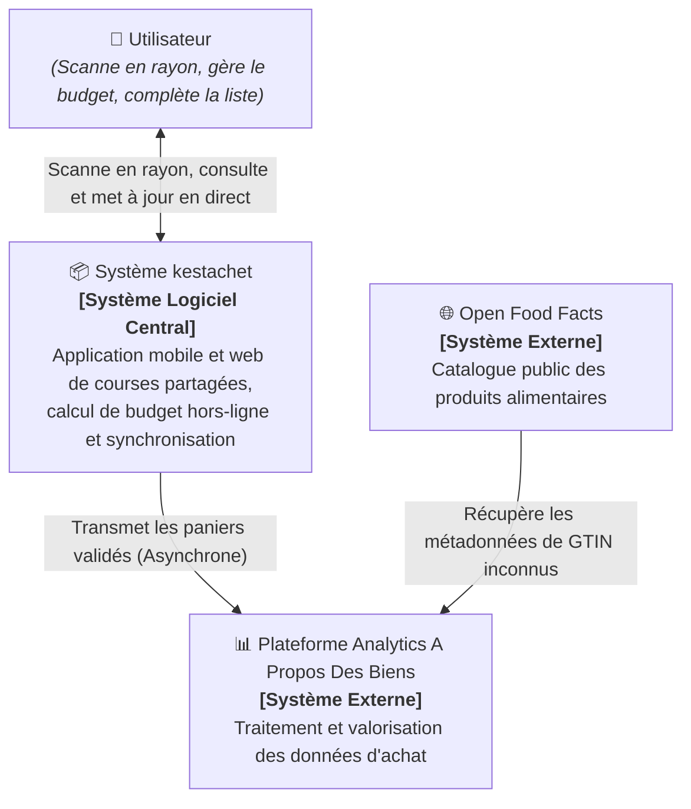
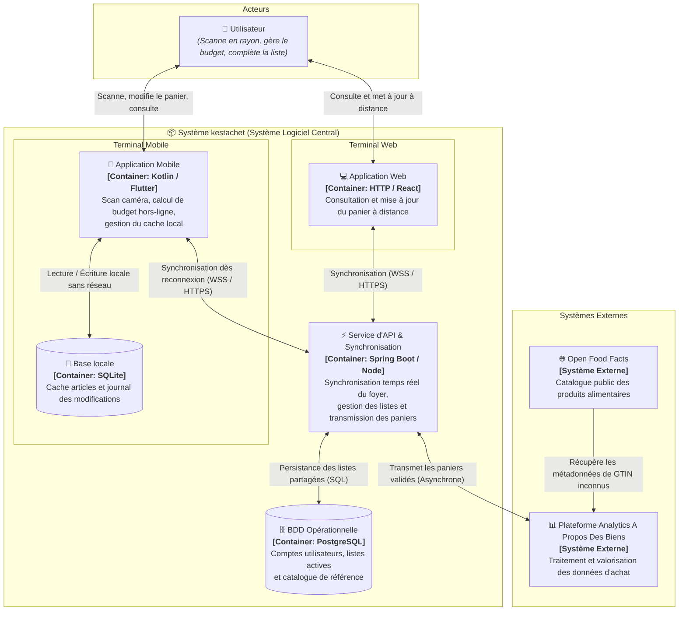
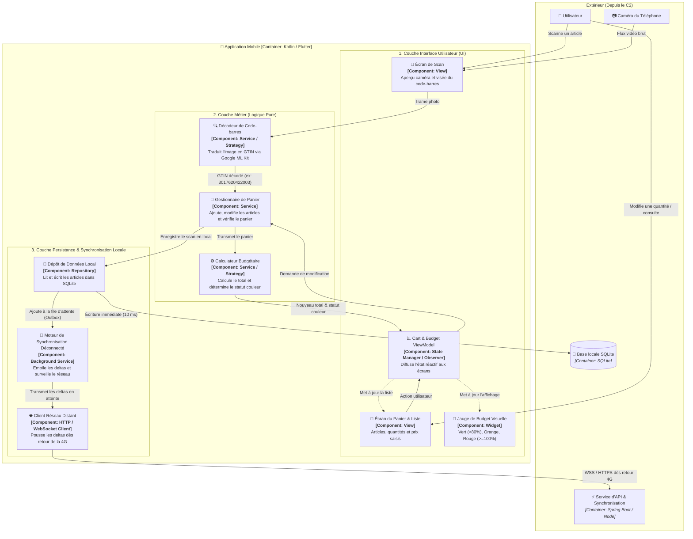
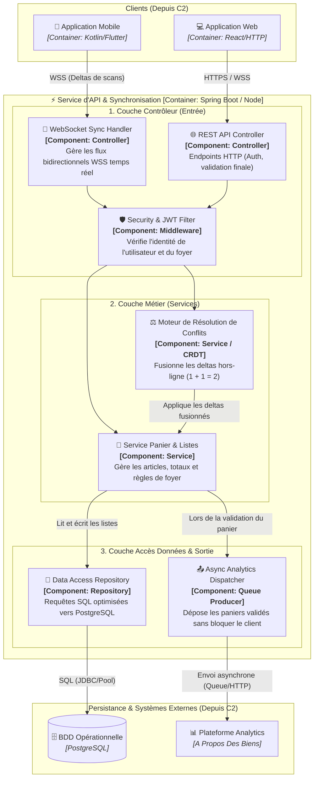
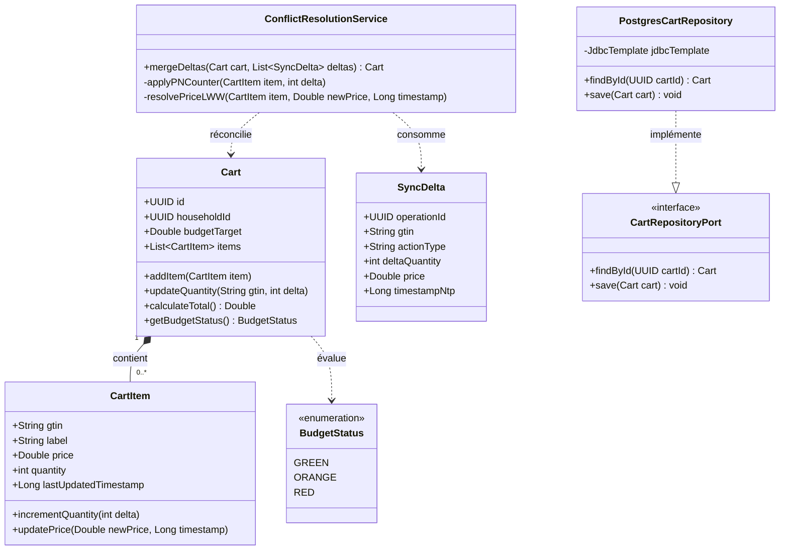

---
tags:
  - C4Model
  - Architecture
  - Diagrams
  - Kestachet
  - C1
  - C2
  - C3
  - C4
  - Mermaid
date: 2026-09-08
course: 4.1 | Projet de synthèse — Kestachet
subject: Dossier Complet des Schémas d'Architecture (Hexagonale & C1 à C4)
---

# 📐 Kestachet — Dossier Complet des Schémas (Hexagonale & C1 à C4)

> [!NOTE] **Présentation des 4 Niveaux de Zoom C4**
> Le **C4 Model** (créé par Simon Brown) permet de décrire l'architecture logicielle comme une carte Google Maps :
> - **Niveau 1 (C1) — Contexte Système** : La vue d'ensemble (qui utilise le système et avec quels services externes il communique).
> - **Niveau 2 (C2) — Conteneurs** : Les grosses briques logicielles déployables (Apps mobiles, Web, APIs, Bases de données).
> - **Niveau 3 (C3) — Composants** : Le zoom à l'intérieur d'un conteneur spécifique (ici le service d'API).
> - **Niveau 4 (C4) — Code** : Le zoom microscopique sur les classes UML et l'algorithme métier.

---


---

## ⬡ 0. Schéma d'Architecture Hexagonale (Étape 1 : Application Mobile)

Ce schéma représente l'**Architecture Hexagonale (*Ports & Adaptateurs*)** de l'application mobile, demandée à l'**Étape 1** du sujet. 
Il illustre la règle d'or : **le cœur métier est pur et isolé**, ce sont les détails techniques (caméra, base SQLite, réseau) qui s'adaptent au métier grâce à l'inversion de dépendance.



### 🗣️ Ce qu'on dit au jury sur l'Architecture Hexagonale (en 30 secondes) :
> *"Voici notre architecture hexagonale pour l'application mobile. Le cœur au centre est du code pur sans aucune dépendance : il gère le panier et le calcul budgétaire. La caméra et la base SQLite sont des adaptateurs interchangeables branchés sur des ports (interfaces). Grâce au pattern **Strategy**, si demain Google change son SDK de scan caméra, nous changeons uniquement l'adaptateur sans toucher à une seule ligne du calcul de budget."*

## 🌍 1. Niveau 1 : Contexte Système (C1)

Le schéma de contexte présente les acteurs humains et les systèmes informatiques externes en relation avec l'application **kestachet**.



### 🗣️ Ce qu'on dit au jury sur le C1 (en 20 secondes) :
> *"Le niveau 1 montre notre périmètre : l'utilisateur interagit avec le système central **kestachet** pour scanner ses articles et suivre son budget. Quand un panier est validé, les données sont transmises de manière asynchrone à la plateforme analytique d'**A Propos Des Biens**, qui s'enrichit automatiquement via le catalogue externe **Open Food Facts** pour les produits inconnus."*

---

## 📦 2. Niveau 2 : Conteneurs (C2)

Le schéma de conteneurs zoome dans le système central **kestachet** pour identifier les applications, les bases de données et les protocoles réseau utilisés.



### 🗣️ Ce qu'on dit au jury sur le C2 (en 30 secondes) :
> *"Le niveau 2 détaille nos conteneurs : sur le mobile, une base **SQLite** permet à l'utilisateur de scanner et calculer son budget même en sous-sol sans réseau (**Offline-First**). Dès qu'il capte la 4G, l'application synchronise ses modifications via WebSockets/HTTPS avec notre **Service d'API**. Ce service met à jour la base centrale **PostgreSQL** pour la famille et transfère les paniers validés à la plateforme **Analytics** en arrière-plan."*

---

## 🧩 3. Niveau 3 : Composants (C3)

Dans notre système, deux conteneurs principaux méritent un zoom C3 :
- **3.1 L'Application Mobile** (le client qui tourne hors-ligne en rayon).
- **3.2 Le Service d'API & Synchronisation** (le serveur central qui réconcilie les données).

---

### 3.1 Schéma C3 : Zoom sur l'"Application Mobile" [Container: Kotlin / Flutter]

Ce schéma fait un zoom à l'intérieur du conteneur **`📱 Application Mobile`** pour montrer ses composants logiciels internes et comment ils communiquent avec la caméra, l'écran, SQLite et le serveur :



#### Rôle des composants de l'application mobile (à dire au jury) :
1. **Écran de Scan & Décodeur (`SCAN_SERVICE`)** : Capture le flux de la caméra physique et décode le code-barres en GTIN sans bloquer l'interface.
2. **Gestionnaire de Panier & Calculateur de Budget (`BUDGET_CALCULATOR`)** : Le cœur métier. Il calcule le montant et bascule la jauge au vert, orange ou rouge directement sur le processeur du smartphone.
3. **Dépôt Local (`LOCAL_REPO`)** : Persiste chaque article dans la base **SQLite** en 10 millisecondes. L'application ne dépend d'aucun serveur pour fonctionner.
4. **Moteur de Synchronisation (`SYNC_WORKER`)** : Enregistre chaque action dans un journal local. Dès que la 4G revient, il pousse les modifications vers l'API sans perturber l'utilisateur.

---

### 3.2 Schéma C3 : Zoom sur le "Service d'API & Synchronisation" [Container: Spring Boot / Node]



### 🗣️ Ce qu'on dit au jury sur le C3 (en 30 secondes) :
> *"Le niveau 3 zoome sur l'API : les requêtes arrivent par les contrôleurs **WebSocket** et **REST**, filtrées par un module de sécurité **JWT**. Le composant clé est le **Moteur de Résolution de Conflits** qui fusionne automatiquement les ajouts d'articles sans écrasement (CRDT). Enfin, le **Repository** persiste l'état dans PostgreSQL et le **Dispatcher Asynchrone** envoie les paniers vers Analytics sans faire attendre le client."*

---

## 💻 4. Niveau 4 : Code (C4)

Le schéma de code zoome à l'échelle des classes orientées objet (diagramme de classes UML) sur le composant métier **`Moteur de Résolution de Conflits`** et **`Service Panier`**.



### Algorithme concret d'implémentation (Java / Spring Boot) :

```java
@Service
public class ConflictResolutionService {

    /**
     * Fusionne les deltas hors-ligne reçus du smartphone sans écraser les données.
     */
    public Cart mergeDeltas(Cart cart, List<SyncDelta> incomingDeltas) {
        for (SyncDelta delta : incomingDeltas) {
            // Récupère l'article existant ou le crée s'il est nouveau
            CartItem item = cart.findItemByGtin(delta.getGtin())
                .orElseGet(() -> cart.createItem(delta.getGtin()));

            // 1. Règle CRDT (PN-Counter) : on additionne le delta (+1, +2, etc.)
            item.incrementQuantity(delta.getDeltaQuantity());

            // 2. Règle Last-Write-Wins (LWW) sur le prix si saisi manuellement
            if (delta.getPrice() != null && delta.getTimestampNtp() > item.getLastUpdatedTimestamp()) {
                item.updatePrice(delta.getPrice(), delta.getTimestampNtp());
            }
        }
        return cart;
    }
}
```

### 🗣️ Ce qu'on dit au jury sur le C4 (en 20 secondes) :
> *"Le niveau 4 illustre notre modèle objet : la classe `Cart` regroupe des `CartItem`. La méthode `mergeDeltas` applique l'addition mathématique sur les quantités : deux téléphones ayant scanné 1 lait chacun produisent $1 + 1 = 2$ bouteilles. L'interface `CartRepositoryPort` respecte l'inversion de dépendance pour isoler le stockage SQL."*
