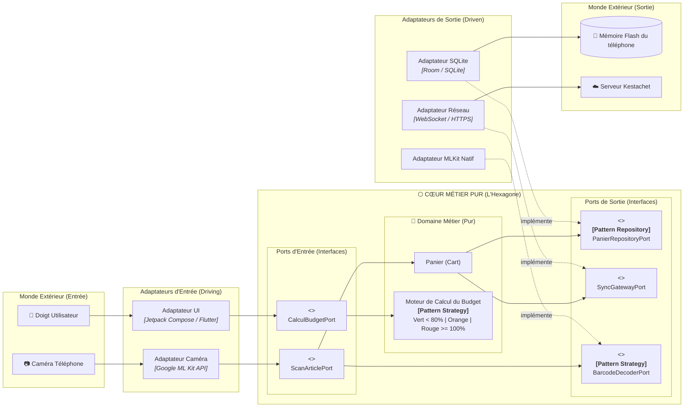
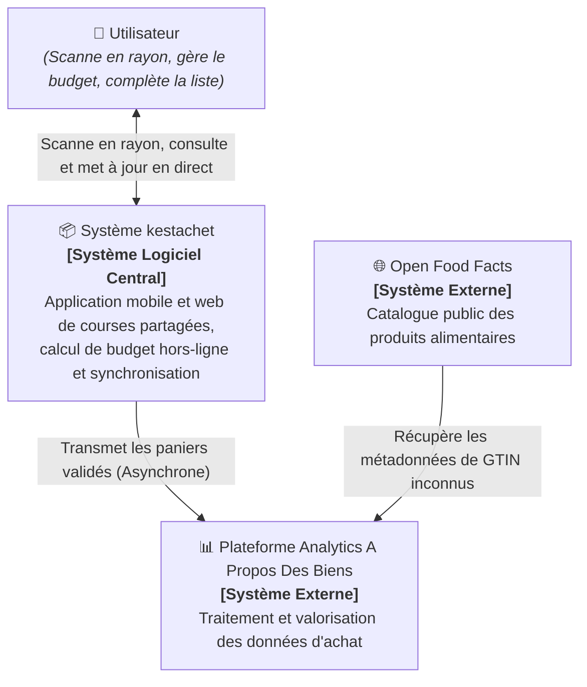
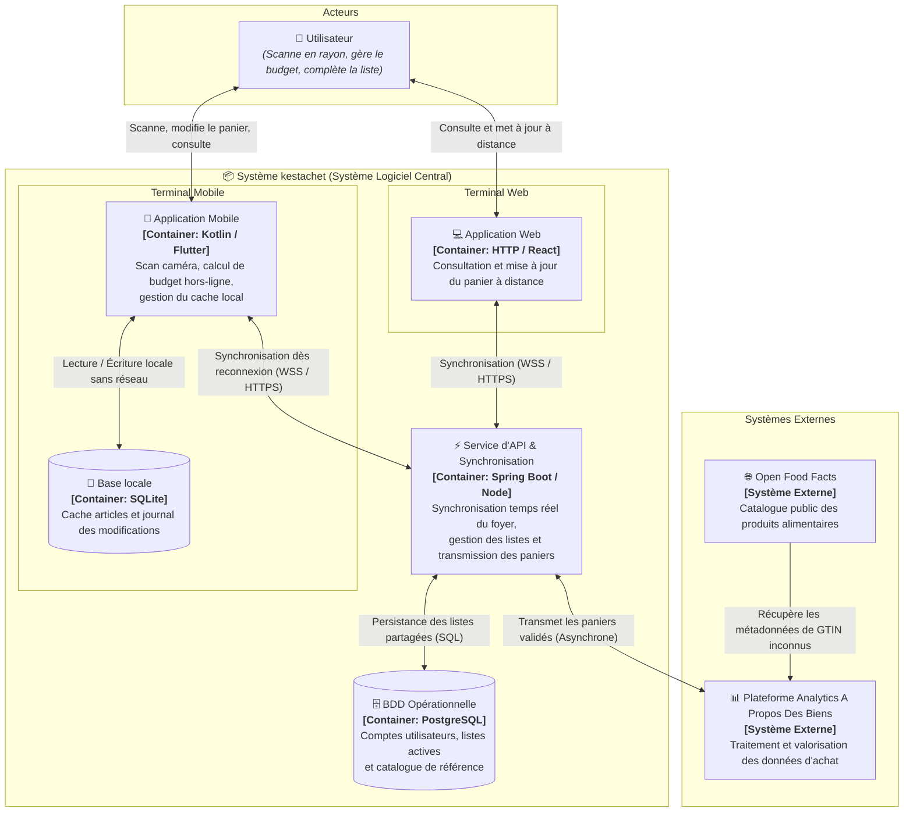
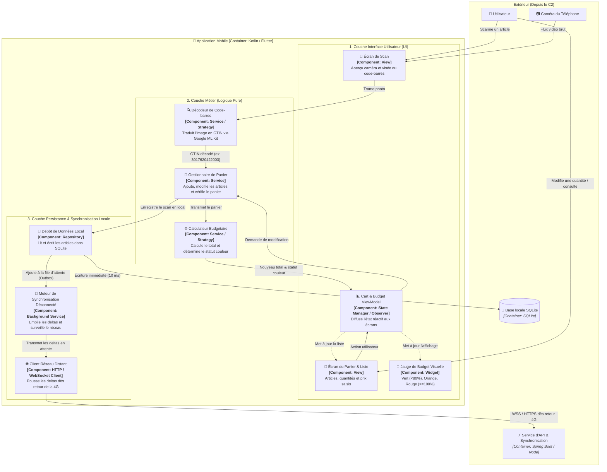
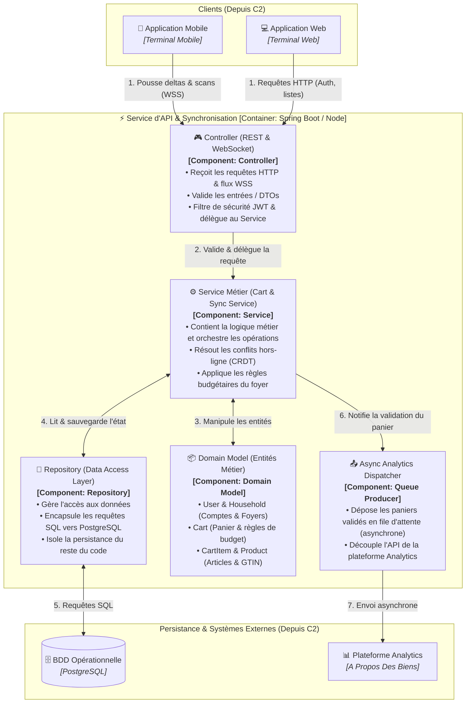
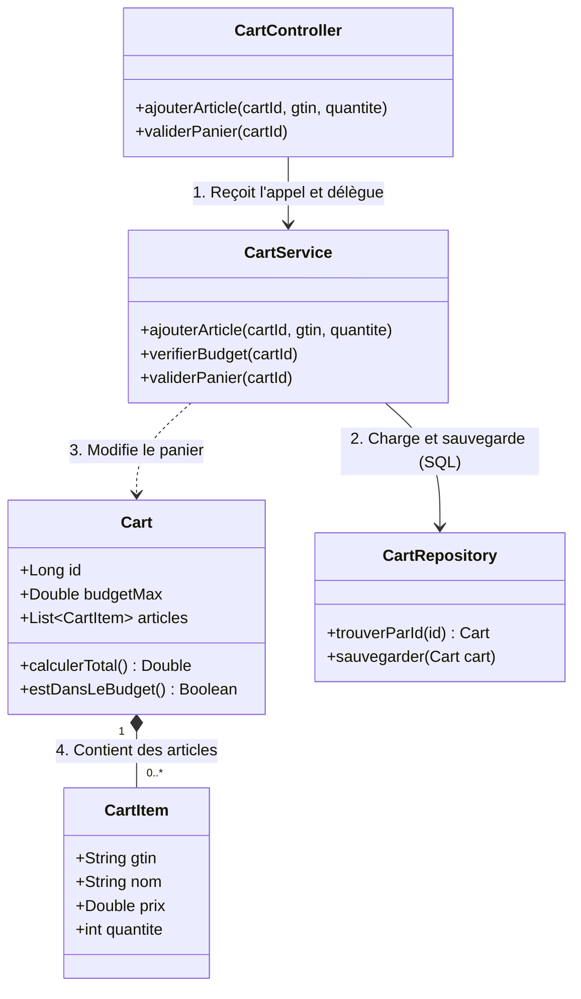
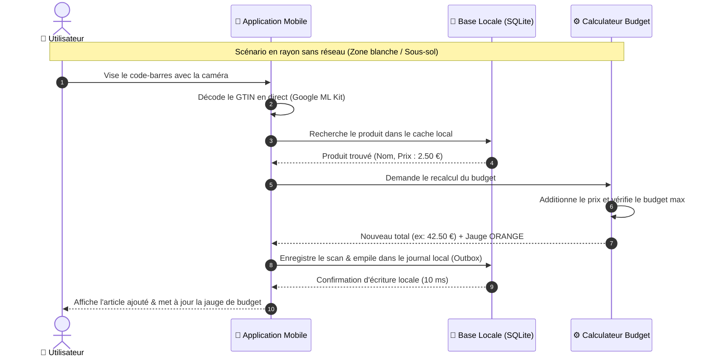
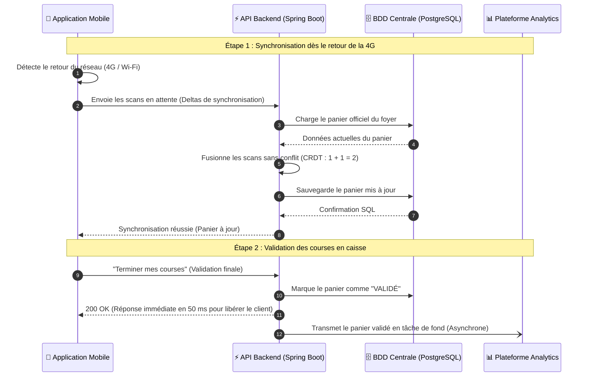

---
tags:
  - C4Model
  - Architecture
  - Diagrams
  - Kestachet
  - C1
  - C2
  - C3
  - C4
  - Mermaid
date: 2026-09-08
course: 4.1 | Projet de synthèse — Kestachet
subject: Dossier Complet des Schémas d'Architecture (Hexagonale & C1 à C4)
---

# 📐 Kestachet — Dossier Complet des Schémas (Hexagonale & C1 à C4)

> [!NOTE] **Présentation des 4 Niveaux de Zoom C4**
> Le **C4 Model** (créé par Simon Brown) permet de décrire l'architecture logicielle comme une carte Google Maps :
> - **Niveau 1 (C1) — Contexte Système** : La vue d'ensemble (qui utilise le système et avec quels services externes il communique).
> - **Niveau 2 (C2) — Conteneurs** : Les grosses briques logicielles déployables (Apps mobiles, Web, APIs, Bases de données).
> - **Niveau 3 (C3) — Composants** : Le zoom à l'intérieur d'un conteneur spécifique (ici le service d'API).
> - **Niveau 4 (C4) — Code** : Le zoom microscopique sur les classes UML et l'algorithme métier.

---


---

## ⬡ 0. Schéma d'Architecture Hexagonale (Étape 1 : Application Mobile)

Ce schéma représente l'**Architecture Hexagonale (*Ports & Adaptateurs*)** de l'application mobile, demandée à l'**Étape 1** du sujet. 
Il illustre la règle d'or : **le cœur métier est pur et isolé**, ce sont les détails techniques (caméra, base SQLite, réseau) qui s'adaptent au métier grâce à l'inversion de dépendance.



### 🗣️ Ce qu'on dit au jury sur l'Architecture Hexagonale (en 30 secondes) :
> *"Voici notre architecture hexagonale pour l'application mobile. Le cœur au centre est du code pur sans aucune dépendance : il gère le panier et le calcul budgétaire. La caméra et la base SQLite sont des adaptateurs interchangeables branchés sur des ports (interfaces). Grâce au pattern **Strategy**, si demain Google change son SDK de scan caméra, nous changeons uniquement l'adaptateur sans toucher à une seule ligne du calcul de budget."*

## 🌍 1. Niveau 1 : Contexte Système (C1)

Le schéma de contexte présente les acteurs humains et les systèmes informatiques externes en relation avec l'application **kestachet**.



### 🗣️ Ce qu'on dit au jury sur le C1 (en 20 secondes) :
> *"Le niveau 1 montre notre périmètre : l'utilisateur interagit avec le système central **kestachet** pour scanner ses articles et suivre son budget. Quand un panier est validé, les données sont transmises de manière asynchrone à la plateforme analytique d'**A Propos Des Biens**, qui s'enrichit automatiquement via le catalogue externe **Open Food Facts** pour les produits inconnus."*

---

## 📦 2. Niveau 2 : Conteneurs (C2)

Le schéma de conteneurs zoome dans le système central **kestachet** pour identifier les applications, les bases de données et les protocoles réseau utilisés.



### 🗣️ Ce qu'on dit au jury sur le C2 (en 30 secondes) :
> *"Le niveau 2 détaille nos conteneurs : sur le mobile, une base **SQLite** permet à l'utilisateur de scanner et calculer son budget même en sous-sol sans réseau (**Offline-First**). Dès qu'il capte la 4G, l'application synchronise ses modifications via WebSockets/HTTPS avec notre **Service d'API**. Ce service met à jour la base centrale **PostgreSQL** pour la famille et transfère les paniers validés à la plateforme **Analytics** en arrière-plan."*

---

## 🧩 3. Niveau 3 : Composants (C3)

Dans notre système, deux conteneurs principaux méritent un zoom C3 :
- **3.1 L'Application Mobile** (le client qui tourne hors-ligne en rayon).
- **3.2 Le Service d'API & Synchronisation** (le serveur central qui réconcilie les données).

---

### 3.1 Schéma C3 : Zoom sur l'"Application Mobile" [Container: Kotlin / Flutter]

Ce schéma fait un zoom à l'intérieur du conteneur **`📱 Application Mobile`** pour montrer ses composants logiciels internes et comment ils communiquent avec la caméra, l'écran, SQLite et le serveur :



#### Rôle des composants de l'application mobile (à dire au jury) :
1. **Écran de Scan & Décodeur (`SCAN_SERVICE`)** : Capture le flux de la caméra physique et décode le code-barres en GTIN sans bloquer l'interface.
2. **Gestionnaire de Panier & Calculateur de Budget (`BUDGET_CALCULATOR`)** : Le cœur métier. Il calcule le montant et bascule la jauge au vert, orange ou rouge directement sur le processeur du smartphone.
3. **Dépôt Local (`LOCAL_REPO`)** : Persiste chaque article dans la base **SQLite** en 10 millisecondes. L'application ne dépend d'aucun serveur pour fonctionner.
4. **Moteur de Synchronisation (`SYNC_WORKER`)** : Enregistre chaque action dans un journal local. Dès que la 4G revient, il pousse les modifications vers l'API sans perturber l'utilisateur.

---

### 3.2 Schéma C3 : Zoom sur le "Service d'API & Synchronisation" [Container: Spring Boot / Node]

Ce schéma montre l'organisation interne du conteneur Backend selon l'**architecture en couches classique** articulée autour de **4 composants fondamentaux** :
- **Controller** : Réception et validation des requêtes HTTP/WSS.
- **Service** : Logique métier et orchestration (règles de panier, fusion CRDT).
- **Repository** : Accès aux données et requêtes SQL vers PostgreSQL.
- **Domain Model** : Entités métier manipulées par le système.



#### Les 4 Composants Fondamentaux du C3 (à dire au jury) :

| Composant | Rôle standard | Rôle concret dans **Kestachet** |
| :--- | :--- | :--- |
| **🎮 Controller** | Reçoit les requêtes HTTP/WSS, valide les entrées, délègue au service. | Gère les endpoints REST et la connexion WebSocket, valide les DTOs (GTIN, prix, quantités) et vérifie les tokens JWT. |
| **⚙️ Service** | Contient la logique métier, orchestre les opérations. | Résout les conflits de synchronisation (CRDT), recalcule le budget, applique les règles de gestion du foyer et déclenche les événements. |
| **💾 Repository** | Gère l'accès aux données, encapsule les requêtes SQL. | Fournit les méthodes d'accès (CRUD via JPA/Hibernate/Prisma) et exécute les requêtes SQL vers PostgreSQL. |
| **📦 Domain Model** | Représente les entités métier au cœur de l'application. | Objets métier purs : `User`, `Household` (Foyer), `Cart` (Panier), `CartItem` (Article scanné), `Product` (Catalogue). |
| **📤 Async Dispatcher** | Composant de sortie asynchrone (Queue / Broker). | Envoie le panier validé vers la plateforme Analytics *A Propos Des Biens* sans faire attendre l'utilisateur en caisse. |

### 🗣️ Ce qu'on dit au jury sur le C3 (en 30 secondes) :
> *"Le niveau 3 zoome sur l'API et met en valeur notre architecture en couches propre : les requêtes arrivent sur le **Controller** qui valide les données et vérifie l'authentification. Il délègue au **Service** qui contient la logique métier (calculs et réconciliation sans conflit CRDT). Ce service manipule notre **Domain Model** (`Cart`, `User`, `Product`) et fait appel au **Repository** pour exécuter les requêtes SQL dans PostgreSQL. Enfin, lors de la validation du panier, le **Dispatcher Asynchrone** transmet les données d'achat vers Analytics en arrière-plan."*

---

## 💻 4. Niveau 4 : Code (C4) — Version Débutant Simple

> [!TIP] **L'idée clé pour le jury**
> Le **C4 (Niveau Code)** zoome sur le code d'une action très concrète : **l'ajout d'un article dans le panier**.
> On retrouve simplement les **4 briques** vues en cours d'informatique :
> 1. **`CartController`** : Reçoit l'appel du smartphone (endpoint REST).
> 2. **`CartService`** : Contient la logique métier (calcul du budget).
> 3. **`Cart` & `CartItem`** : Représentent le panier et les articles.
> 4. **`CartRepository`** : Sauvegarde dans la base de données PostgreSQL.



---

### Le Code Java Minimal (Très facile à lire et expliquer) :

```java
// 1. LE CONTROLLER : Reçoit la requête HTTP envoyée par l'application mobile
@RestController
@RequestMapping("/api/panier")
public class CartController {

    @Autowired
    private CartService cartService;

    @PostMapping("/{cartId}/articles")
    public Cart ajouterArticle(@PathVariable Long cartId, 
                              @RequestParam String gtin, 
                              @RequestParam int quantite) {
        return cartService.ajouterArticle(cartId, gtin, quantite);
    }
}

// 2. LE SERVICE : Logique métier (vérification, calcul et sauvegarde)
@Service
public class CartService {

    @Autowired
    private CartRepository cartRepository;

    public Cart ajouterArticle(Long cartId, String gtin, int quantite) {
        // 1. On récupère le panier depuis la base de données PostgreSQL
        Cart cart = cartRepository.trouverParId(cartId);

        // 2. On ajoute l'article ou on incrémente la quantité
        cart.ajouterArticle(gtin, quantite);

        // 3. On sauvegarde le panier mis à jour
        return cartRepository.sauvegarder(cart);
    }
}
```

---

### 🗣️ Ce qu'on dit au jury sur le C4 (Script en 20 secondes) :
> *"Pour notre C4, nous avons zoomé sur le code d'une action essentielle : l'ajout d'un article dans le panier.*
> *1. Le **CartController** reçoit la requête envoyée par le smartphone lors d'un scan.*
> *2. Il appelle le **CartService** qui contient la logique métier et calcule le budget.*
> *3. Ce service manipule notre objet **Cart** qui regroupe les **CartItem**.*
> *4. Enfin, le **CartRepository** sauvegarde le tout dans la base de données PostgreSQL."*

---

## 🔄 5. Diagrammes de Séquence (Dynamique du Système)

Les diagrammes de séquence complètent la vue statique (C1 à C4) en illustrant **l'ordre chronologique des échanges** lors des deux scénarios clés de Kestachet.

---

### 5.1 Séquence 1 : Le Scan en rayon (Mode Hors-Ligne / Offline-First)

Ce schéma montre ce qui se passe quand l'utilisateur scanne un article dans un supermarché **sans aucune connexion réseau** :
- Tout se déroule localement sur le téléphone en **moins de 16 ms**.
- La jauge budgétaire se met à jour immédiatement sur l'écran.
- L'action est mémorisée dans un journal local (Outbox) pour synchronisation future.



> [!TIP] **Ce qu'on dit au jury sur la Séquence 1** :
> *"Ce diagramme prouve notre fonctionnement **Offline-First** : chaque étape (scan caméra, recherche de l'article, calcul du budget et enregistrement SQLite) s'exécute à 100% sur le téléphone sans faire appel à internet. L'utilisateur n'a aucun ralentissement."*

---

### 5.2 Séquence 2 : Reconnexion 4G, Synchronisation et Envoi Analytics

Ce schéma montre ce qui se passe quand l'utilisateur sort du magasin et que la connexion est rétablie :
- L'application envoie son journal de modifications en attente.
- L'API fusionne les articles sans conflit (CRDT : $1 + 1 = 2$).
- Lors de la validation finale, l'utilisateur est libéré immédiatement en 50 ms pendant que le panier est transmis à la plateforme Analytics en arrière-plan.



> [!TIP] **Ce qu'on dit au jury sur la Séquence 2** :
> *"Ce second diagramme illustre notre architecture distribuée résiliente : l'API réconcilie automatiquement les ajouts du foyer sans écrasement, et la validation du panier utilise un découplage asynchrone pour ne jamais faire attendre le client devant la caisse."*
